# 🧾 O PADEIRO *script*

🗨️ **pt-BR** ⚡ Ferramenta de preenchimento em massa de templates e outras utilidades no After Effects ⚡

O script duplica comps, preenche conteúdo de texto e cria a fila de render em um projeto template. ideal para lidar com volumes grandes de "*artes iguais*" e caminhos de rede longos e confusos.

a proposta de workflow é simples, são 3 etapas:\
`1 buscar​` > ​`2 selecionar​` > ​`3 preencher​`

> 📂 **arquivos:**\
> • **O PADEIRO instalador.jsx** → aquivo que deve ser executado no after effects.\
> • **O_PADEIRO_SOURCE.jsxbin** → arquivo que contém o binário do script.

<br>

## 📍 habilitando o acesso a rede

para que o sistema de templates funcione é preciso habilitar o acesso a rede, acesse:\
`Edit` > `Preferences` > `Scripting & Expressions...`\
e habilite a opção '**Allow Scripts to Write Files and Access Network**'.

> 📋 *exemplo:*\
> 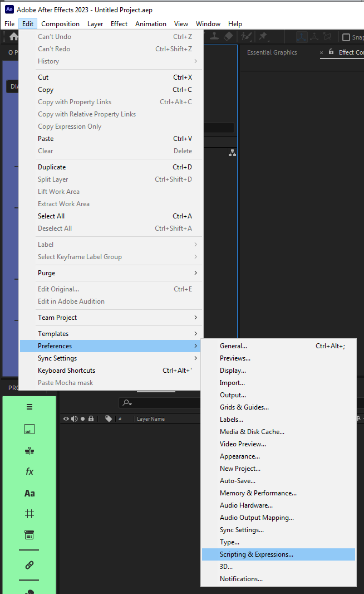
> 

<br>

## 📍 instalação

instale o script pelo menu:\
`File` > `Scrips` > `Run Script File...`

> 📋 *exemplo:*\
> 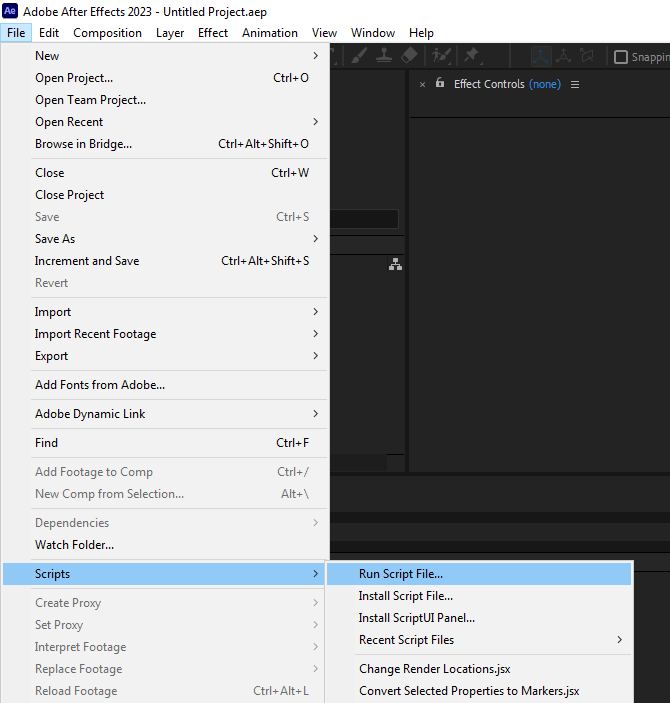

> 📟 *interface do instalador:*
>
> 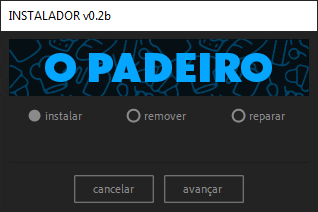

selecione a opção '*instalar*' e clique em '*avançar*'

após a instalação, **reinicie** o After Effects e o `O PADEIRO` aparecerá na última seção do menu '*Window*' e poderá ser acoplado a qualquer painel da interface.

> 📋 *exemplo:*\
> 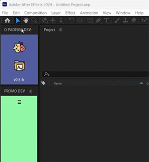

<br>

---

<br>

## 📍 adicionando pastas de produção

uma pasta de produção é um pasta que contem ou irá conter templates do padeiro. cada pasta pode conter outras subpastas com um ou mais templates.

ao executar o script pela primeira vez, o editor de pastas de produção será aberto automaticamente.\
o arquivo da lista de produção será salvo na mesma pasta do script e compartilhado entre todos os usuários que executarem o script a partir desta mesma pasta, assim todos os membros de uma equipe terão a mesma lista de produções e seus respectivos templates.

> 📟 *interface do editor de pastas de produção:*
>
> 

1. `◖ clique DUPLO esquerdo` no ícone da produção para abrir o editor.
2. clique no botão '*+ nova produção*'.
3. edite a pasta de templates.
4. selecione um ícone para a produção.
5. edite o nome da produção.
6. clique no botão '*salvar lista*'.

> 🚩 *obs:*\
> • as produções serão sempre organizadas alfabeticamente na lista.\
> • use caracteres especiais ou números no início do nome da produção para coloca-la no início da lista.\
> • é possível **exportar** e **importar** a lista completa de produções, incluindo seus respectivos ícones.\
> • as dimensões sugeridas para um ícone são **24 x 24 pixels**, imagens maiores serão cropadas no preview e redimensionadas ao salvar os dados da lista.

<br>

---

<br>

## 📍 a interface principal

a interface principal do padeiro pode assumir um layout vertical ou horizontal de acordo com o tamanho do painel.

> 📟 launcher:
>
> 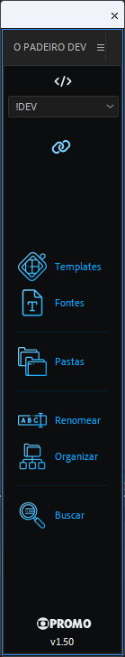

ferramentas disponíveis em ordem:

- **ÍCONE DE PRODUÇÃO**:\
`◖ clique DUPLO esquerdo` → abre o editor de pastas de produção.
  >

- **MENU DE PRODUÇÃO**:\
`◖ clique esquerdo` → seleciona a pasta da produção atual.
  >

- **O PADEIRO**:\
`◖ clique esquerdo` → abre a interface de templates.\
`◗ clique direito` → abre a interface do criador de templates.
  >

- **RESOLVER FONTES**:\
`◖ clique esquerdo` → instala as fontes necessárias para o template.\
`◗ clique direito` → faz o collect dos arquivos de fonte do projeto.
  >

- **ABRIR PASTAS**:\
`◖ clique esquerdo` → abre a pasta de output do último item da fila de render.\
`◗ clique direito` → abre a pasta do projeto atual.
  > *se o projeto já foi salvo.*

- **RENOMEAR**:\
`◖ clique esquerdo` → renomeia comps selecionadas.\
`◗ clique direito` → renomeia todos os itens da fila de render.
  > *remove caracteres especiais, colocando tudo em CAIXA ALTA e acrescenta os prefixos para rodapés, cartões, letterings, etc.*

- **ORGANIZAR**:\
`◖ clique esquerdo` → organiza o projeto.\
`◗ clique direito` → cria apenas a estrutura de pastas no projeto.
  > *antes de clicar,selecione as comps principais (as que devem ser renderizadas) para que elas sejam adicionadas a pasta '01 COMPS'*

- **BUSCA**:\
`◖ clique esquerdo` → abre a janela de busca.
  > *a busca funciona apenas no conteúdo dos layers de texto do projeto.*

<!-- - **APONTAMENTO**:\
`◖ clique esquerdo` → abre a planilha de apontamento de projetos. -->

> 🚩 *obs:*\
> • a versão atual do script é sempre exibida na lateral direita para o layout horizontal e no canto inferior para o layout vertical.\
> • para atualizar o script, caso exista uma nova versão disponível, basta fechar o script e executa-lo novamente.

---

<br>

## 📍 criando um novo template

um template do padeiro é um conjunto de arquivos que inclui: um *projeto* do after effects com uma comp principal, preferencialmente salvo com a extensão '*.aet*', um arquivo de configuração '*_config.json*' com as informações necessárias para o preenchimento correto do template, uma imagem de preview '*_preview.png*' e uma pasta com todas os arquivos de fontes usadas no projeto.

> 📟 *interface do criador de templates:*
>
> 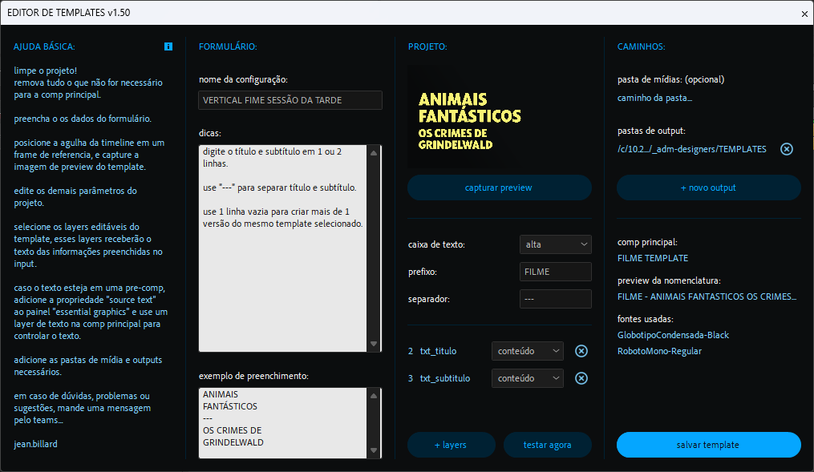

1. limpe o projeto, remova tudo o que não for necessário para a comp principal.
2. `◗ clique direito` no botão com ícone de paninho para abrir a interface do criador de templates.
3. preencha o '*nome da configuração*', as '*dicas*' e o '*exemplo de preenchimento*'.
4. posicione a agulha da timeline em um frame de referência e clique no botão '*capturar preview*'.
5. selecione / preencha o padrão de '*caixa de texto*' do projeto, o '*prefixo*' e o '*separador*' de informações.
6. selecione os layers editáveis em ordem de preenchimento e clique no botão '*selecionar layers*'.
7. edite a '*pasta de mídia: (opcional)*' e as '*pastas de output*'.
8. use o botão '*testar agora*' para verificar o preenchimento das informações inseridas no '*exemplo de preenchimento*'.
9. clique no botão '*salvar template*' para salvar o template,preferencialmente com a extensão '.aet'.

<br>

o script executará as seguintes tarefas em ordem:

1. adicionar o comentário 'TEMPLATE' na comp principal.
2. salvar o projeto.
3. gerar um arquivo de preview da comp principal.
4. gerar um arquivo de configuração do template.
5. copiar todos os arquivos de fontes usados no projeto.
6. abrir a pasta com todos os arquivos do template.

### formulário

> 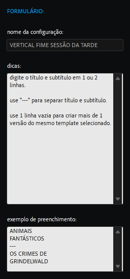

- **nome da configuração** → identificador da configuração do template.
- **dicas** → instruções de como preencher o template.
- **exemplo de preenchimento** → idealmente, será o input de texto usado para produzir a imagem do preview.

> 🚩 *obs:*\
> • o '*nome da configuração*' serve apenas para identificação do template no log do script.
> • seja bastante claro nas dicas, inclua instruções para importar footages, controles de expressão e tudo o que for necessário.

### preview e projeto

> 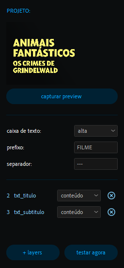

- **capturar** → gera o preview do template.

<br>

- **caixa de texto**
  - **alta** → converte a caixa de texto do projeto para caixa ALTA.
  - **baixa** → converte a caixa de texto do projeto para caixa baixa.
  - **título** → converte a caixa de texto do projeto para caixa Título.
  - **livre** → não executa nenhuma conversão da caixa de texto do projeto.
- **prefixo** → prefixo adicionado em todas as versões geradas do template.
- **separador** → o texto usado para separar as informações de tipos diferentes.
- **+ layers** → adiciona os layers selecionados da comp principal.
- **testar agora** → preenche os layers selecionados com o exemplo de preenchimento.

> 🚩 *obs:*\
> • todos os textos serão convertidos para a '*caixa de texto*' selecionada.\
> para evitar essa conversão selecione a opção '*livre*'.\
> • o separador só será usado caso exista mais de um layer editável no template.\
> • os layers editáveis serão sempre preenchidos na ordem em que foram selecionados.\
> • ao clicar em '*testar*' um novo preview será capturado e o texto do exemplo de preenchimento terá sua caixa de texto convertida.

### caminhos

> 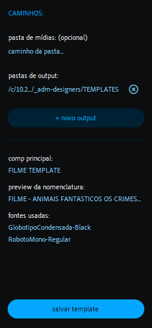

- **pasta de mídia** → seleciona a pasta padrão para a importação de arquivos do projeto.
- **pastas de output** → seleciona a pasta padrão de output do projeto.
- **+ novo output** → adiciona uma nova pasta de output.

<br>

- **comp principal** → comp principal do projeto.
- **preview da nomenclatura** → nome que a comp principal receberá ao ser preenchida com o exemplo de preenchimento.
- **fontes usadas** → lista com o nome de todas as fontes usadas no projeto.

<br>

- **salvar template** → salva o projeto e gera todos os arquivos necessários para o template.

> 🚩 *obs:*\
> • todo template pode ter múltiplas pastas de output.\
> use essa opção para criar cópias do mesmo render em varias pastas.\

> 📋 *exemplo de arquivo de configuração:* *"RODAPE CONVIDADO_config.json"*
>
> ```json
> // "\n" representa uma quebra de linha. :)
> {
>  "configName": "CONVERSA COM BIAL TARJA RODAPÉ CONVIDADO", // → nome da configuração.
>  "exemple": "CÁSSIO\nGABUS MENDES\n---\nATOR",             // → texto de exemplo do input.
>  "tip": "digite o texto em 1, 2 ou 3 linhas para nome e informação.\n\nuse 1 linha com '---' para separar nome e informação.\n\nuse 1 linha vazia para separar mais de 1 versão do mesmo template selecionado.\n\nuse os controles nos efeitos do layer 'ctrl'.", // → texto com as dicas de preenchimento.
>
>  "compName": "RDP - CONVIDADO TEMPLATE", // → nome da comp a ser editada.
>  "prefix": "RDP",                        // → prefixo que o nome da comp editada receberá.
>  "refTime": 2,                           // → tempo, em segundos, do momento em que todas as infos preenchidas estão visíveis na comp.
>  "separator": "---",                     // → texto usado para separar as informações de tipos diferentes.
>  "textCase": "upperCase",                // → o tipo de caixa de texto que o template deve receber: "upperCase", "lowerCase", "titleCase" ou "freeCase".
>
>  "inputLayers": [                             // → lista com os layers editáveis da comp.
>   {"layerIndex": 4, "method": "textContent"}, // → índice do layer: 1, 2, 3, etc.
>   {"layerIndex": 5, "method": "textContent"}  // → método: "layerName" renomeia o layer ou "textContent" preenche o conteúdo de um layer de texto.
>  ],
>
>  "inputFx": {"layerIndex": 1, "fxName": "layout", "optionIndex": 1, "options": ["E","D"]}, // → lista as opções de layout possíveis: "E" e "D", na opção 1 do efeito "layout" no layer 1. (parâmetro opcional).
>
>  "importPath": "~/Downloads", // → Caminho padrão para importar novos footages.
>  "outputPath": [              // → lista com caminhos do output.
>    "//10.228.183.146/edit_in_place/PROMO/cdesign_output/C# ABERTA & INTER/ARTE SP/CONVERSA COM BIAL/CONVIDADOS"
>  ]
> }
> ```

> 🚩 *obs:*\
> • o parâmetro '**inputFx**' ainda não está disponível para a interface do criador de templates mas pode ser adicionado manualmente no arquivo de configuração. ele consiste em indicar um efeito controlador de expressões em um layer da comp principal que controle variações de layout e um array com os sufixos que serão adicionados. útil para gerar variações de layouts ou paletas de cor.

> 📋 *exemplo:*\
> o primeiro layer da comp principal possui um efeito controlador de expressão chamado '**layout**' que controla o alinhamento da tarja. e efeito possui **2 opões** de alinhamento: esquerda e direita e os sufixos '**E**' e '**D**'.\
> assim cada preenchimento deste template gerará **2 comps**, uma com layout alinhado a esquerda, com sufixo '**E**' e outra com layout alinhado a direita com sufixo '**D**'.

<br>

---

<br>

## 📍 preenchendo templates

a interface de templates sempre exibirá a lista de templates disponíveis na pasta de produção no '**menu de produção**'.\
caso não exista nenhum template disponível, a lista aparecerá vazia, mostrando apenas a pasta de produção como raiz.

> 📟 *interface de templates:*
>
> 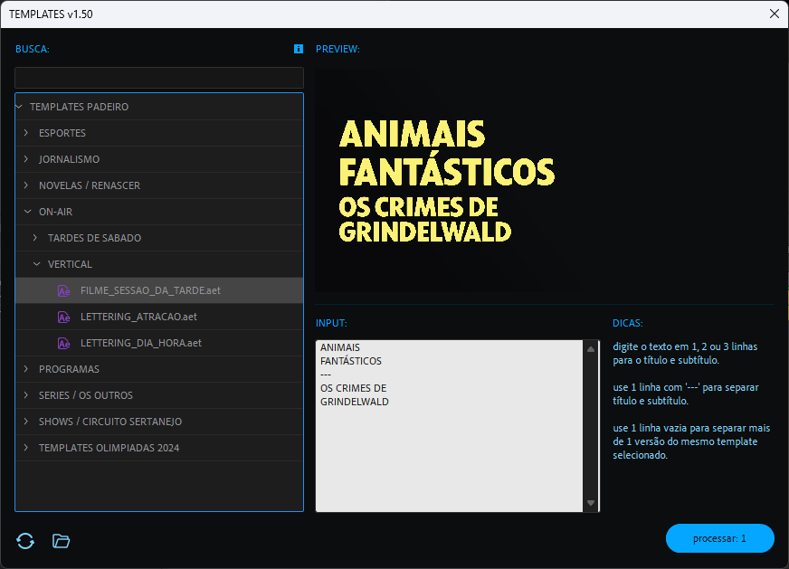

1. `◖ clique esquerdo`  no botão com ícone de paninho para abrir interface de templates.
2. faca uma busca ou navegue pela estrutura da lista.
3. selecione o template desejado.
4. preencha o campo '**input**' seguindo as '**dicas**'.
5. habilite ou não a opção '**adicionar a fila de render**'.
6. clique no botão '**processar**'.

<br>

> 📟 *OPÇÕES DE RENDER:*
>
> 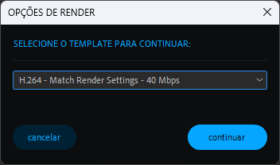

*lista todos os presets disponíveis no After Effects.*

- **templates de render** → seleciona o preset para o render.
- **cancelar** → aborta a criação da fila de render.
- **continuar** → cria a fila de render.

> 🚩 *obs:*\
> • ao cancelar a seleção do preset, o script abortará apenas a criação da fila de render.\
> • caso exista um arquivo de script externo associado ao template, o mesmo ainda será executado.

<br>

> 📟 *PROGRESSO:*
>
> 

*informa o andamento de cada etapa do processo.*

<br>

caso deseje adicionar um novo preset acesse o menu:\
`Edit` > `Templates` > `Presets` > `Output Module...`

> 📋 *exemplo:*\
> 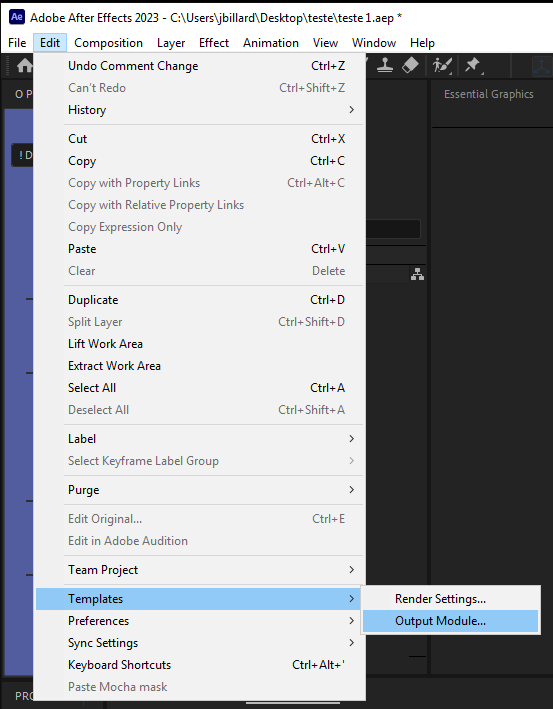

> 🚩 *obs:*\
> • ao cancelar a seleção do preset, o script abortará a criação da fila de render.

<br>

o script executará as seguintes tarefas em ordem:

1. importar os arquivos do projeto.
2. duplicar as comps necessárias.
3. preencher as informações inseridas no input.
4. renomear as comps com base no seu conteúdo.
5. organizar o projeto seguindo0 o padrão da PROMO.
6. adicionar as comps criadas a fila de render
7. setar os caminhos para o output.

> 📋 *exemplo de uso:*\
> 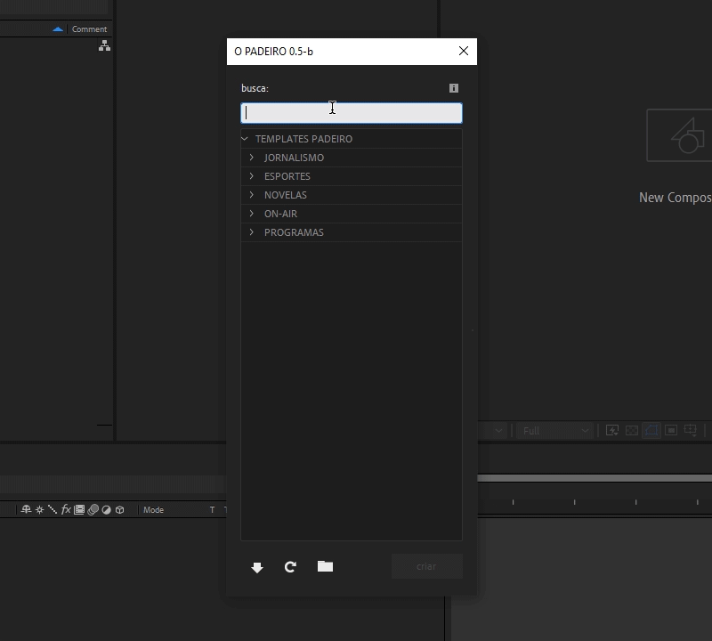\
> 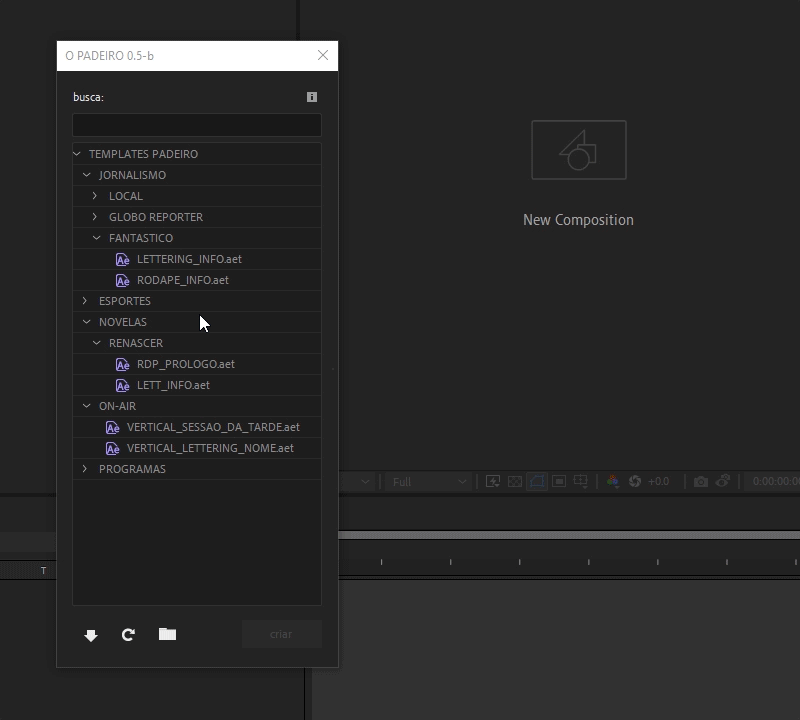\
> 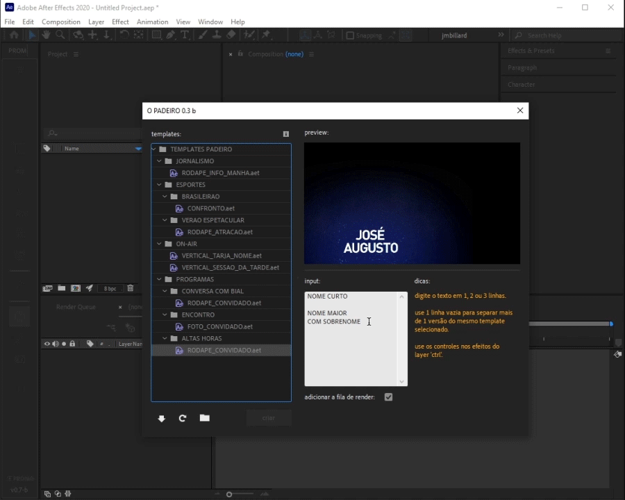\
> 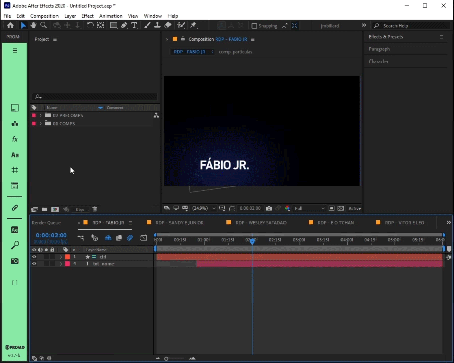

### templates

> 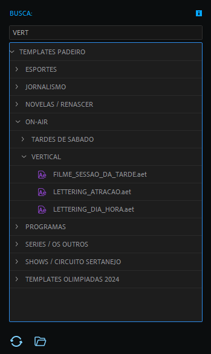

- **busca** → retorna os templates ou pastas com o termo buscado.
- **lista de templates** → árvore com todos os templates disponíveis na pasta de templates do script.
- **ajuda | DOCS** → acessa a documentação provisória do script e seus templates disponíveis.
- **atualizar lista** → verifica e atualiza a lista de templates disponíveis.
- **abrir pasta** → abre a pasta raiz de templates.

> 🚩 *obs:*\
> • ao selecionar um template da lista, a interface do script se ajustará para exibir um preview, o campo de input e dicas, se disponíveis.\
> • apenas os templates podem ser selecionados na lista.\
> • apenas os arquivos com extensão '*.aep*', '*.aet*' e seus diretórios são exibidos na lista.

### preview

> 

- **imagem de preview** → exibe uma imagem de exemplo do template selecionado.

> 🚩 *obs:*\
> • caso não exista uma imagem de preview, será exibido um aviso "PREVIEW NÃO DISPONÍVEL".

### input

> 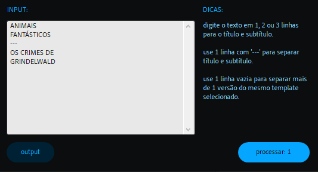

- **texto** → campo de texto editável multifuncional, é o responsável pelo preenchimento de qualquer possível campo de texto do template selecionado.
- **adicionar a fila de render** → se habilitado, adiciona as comps criadas e o seus caminhos corretos no output automaticamente.
- **dicas** → tópicos curtos explicando o preenchimento do template selecionado.
- **output** → abre as pastas de output do template selecionado.
- **processar** → inicia a execução do preenchimento automático.

> 🚩 *obs:*\
> • o '**input**' é pré preenchido com dados genéricos disponíveis no arquivo de configuração do template selecionado e usados para gerar a imagem do preview apenas para exemplificar.\
> • sem um arquivo de configuração, não é possível preencher o template selecionado usando o campo de texto do '**input**'.\
> • você ainda poderá **IMPORTAR** e **PREENCHER MANUALMENTE** o template no After Effects!!!

---

<br>

## 🚨 Atenção!

`CONFIRA SEMPRE AS COMPOSIÇÕES CRIADAS, SEU CONTEÚDO E O CAMINHO DO OUTPUT!`

os layouts dos templates podem variar para exibir ou omitir diferentes tipos de informação, assim, é possível que o resultado final fique diferente do preview.
> 📋 *exemplo:*\
> as comps criadas podem ter layers omitidos por falta de conteúdo inserido ou elementos com cores diferentes das exibidas no preview.

idealmente cada template deve possuir uma imagem com o mesmo **nome exato** do template seguida de '*_preview.png*' e um arquivo de configuração '*_config.json*' com as informações necessárias para o preenchimento correto do template selecionado.
> 📋 *exemplo:*\
> um template chamado *"FOTO_CONVIDADO.aet"* deve estar acompanhado por uma imagem de preview *"FOTO_CONVIDADO_preview.png"* e um arquivo de configuração *"FOTO_CONVIDADO_config.json"*.

o sistema de templates possui padrões internos caso não seja especificado um caminho de output ou a pasta de destino não exista, o mesmo ocorre para o texto separador de informações diferentes.

> 📋 *padrões internos:*\
> • **caminho do output padrão** → '*\Desktop*'.\
> • **separador de informação padrão** → '*---*'.

é possível usar a quebra de linha '*\n*' como separador no arquivo de configuração. muito útil para separar a mesma informação em layers de texto com formatação distintas.

> 📋 *exemplo:*\
> um input com o nome *"Lima\nDuarte"*, em duas linhas, com o primeiro nome *"Lima"* em uma fonte light e o sobrenome "Duarte" em uma fonte bold.

---
<br>

## ✨ dicas

a menos que o projeto possua a '**caixa de texto**' '**livre**', não é necessário se preocupar com o uso de letras **maiúsculas** ou **minúsculas**, o script fará a conversão do texto.

> 📋 *exemplo:*\
> os input "*cauã raymond*", "*CAUà RAYMOND*" ou "*cAuà raYMOnd*" serão exibidos como "*Cauã Raymond*" em um template que usa '*titleCase*' no arquivo de configuração.

é possível importar rapidamente qualquer template da lista executando um clique duplo no mesmo.

---
<br>

## outras utilidades...

- ### **RESOLVER FONTES**:

  `◖ clique esquerdo` → Instala as fontes que o template do padeiro precisa para funcionar corretamente.

  *Ao preencher o template pela interface do padeiro o script armazena no campo '**Source**' dos metadados do projeto o caminho dos arquivos do template, assim é possível fazer a instalação das fontes necessárias facilmente. Após clicar no botão um script de **powershell** copia todos os arquivos de fontes do projeto para a pasta de fontes do sistema.*
  > 📋 *exemplo:*\
  > 

  > *metadados do projeto:*\
  > 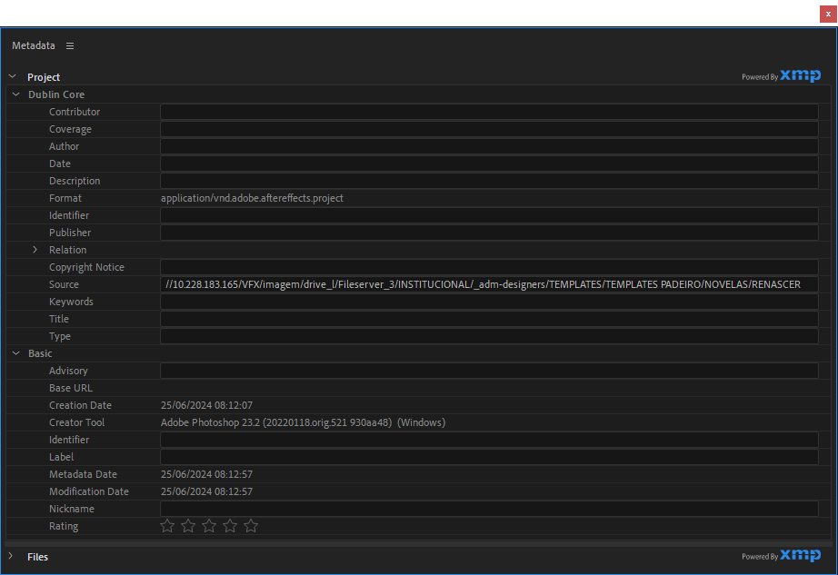

  > *powershell:*\
  > 

  > 🚩 *obs:*\
  > Como essa funcionalidade depende de metadados inseridos pelo padeiro, ela funcionará apenas nos templates preenchidos pelo padeiro!

  <br>

  `◗ clique direito` → Copia todos os arquivos de fontes usadas nos layers de texto do projeto em uma pasta selecionada pelo usuário.

  *O script varre todas os layers de texto de todas as comps do projeto e armazena todas as fontes usadas, em seguida, copia os seus arquivos para uma pasta a sua escolha.*

  > 📋 *exemplo:*\
  > 

  > 🚩 *obs:*\
  > Algumas fontes instaladas apenas na pasta do usuário podem retornar um erro na hora da cópia. Nesse caso, o script alertará quais fontes não puderam ser copiadas.

  <br><br>

- ### **ABRIR PASTAS**:

  `◖ clique esquerdo` → Abre a pasta do **primeiro arquivo** de saída do **último item** da fila de render.

  *O script analisa a fila de render e puxa o último caminho do último item disponível e em seguida abre a respectiva pasta.*

  `◗ clique direito` → Copia para o clipboard o caminho do **primeiro arquivo** de saída do **último item** da fila de render.

  > 🚩 *obs:*\
  > Caso o caminho não seja encontrado por falta de permissão ou falha no mapeamento da rede, o script não retornara o caminho.

  <br><br>

- ### **RENOMEAR**:

  `◖ clique esquerdo` → Altera o nome das comps selecionadas na janela do projeto.

  *O script remove caracteres especiais dos nomes, convertendo tudo em MAIÚSCULAS.\
  Caso as comps selecionadas estejam dentro de uma pasta com de nome específico ou o nome da respectiva comp já possuir algum prefixo / sufixo conhecido, todas comps receberão um prefixo no nome.*

  > 📋 *exemplo:*\
  > 

  > 🚩 *obs:*\
  > Caso uma pasta no projeto esteja selecionada, o script renomeará a pasta e todas as comps dentro da mesma.

  <br>

  `◗ clique direito` → Altera o nome de todos os itens na fila de render.

  *O script analisa o nome das comps de todos os itens da fila de render e aplica as mesmas mudanças do clique esquerdo nos arquivos de saída: remove caracteres especiais, converte em MAIÚSCULAS e adiciona prefixos.*

  > 📋 *exemplo:*\
  > 

  > 🚩 *obs:*\
  > O NOME DAS COMPS NÃO SERÁ ALTERADO!
  > No momento, outputs em sequânica de imagens não suportam subpastas.

  **lista de prefixos e termos reconhecidos**:
  - **RDP** → *RODAPE*
  - **CRT** → *CARTAO, CARTOES, CARTELA, CTO, CTL*
  - **LETT** → *LETTERING*
  - **CONFRONTO**
  - **TRJ** → *TARJA, TAR*
  - **VHT** → *VINHETA*
  - **ASSINA** → *ASSINATURA, ASS*
  - **PASSAGEM** → *PASSAGENS, TRANSICAO, LAPADA*
  - **REF** → *REFERENCIA, PREVIEW*

  <br><br>

- ### **ORGANIZAR**:

  `◖ clique esquerdo` → Organiza o projeto de acordo com o modelo de projeto da PROMO.
  *O script cria várias pastas, como '01 COMPS', '02 PRECOMPS', '03 ARQUIVOS', etc.*
  *As comps selecionadas inicialmente serão organizadas na pasta '01 COMPS'.*
  *O script separa outros arquivos (imagens, sons, etc.) nas pastas certas.*

  > 📋 *exemplo:*\
  > 

  > 🚩 *obs:*\
  > Você deve selecionar as comps principais (as que serão renderizadas) antes de clicar.\
  > Todas as comps selecionadas no momento da organização serão colocadas na pasta '01 COMPS'.\
  > As comps renomeadas pelo script também serão organizadas na pasta '01 COMPS' caso possuam algum termo reconhecido em seu nome e/ou nome da pasta em que estejam contidas.

  <br>

  `◗ clique direito` → Cria apenas a estrutura de pastas no projeto de acordo com o modelo da PROMO.

  > 📋 *exemplo:*\
  > 

  <br><br>

- ### **BUSCA**:

  O script pesquisará no conteúdo de todos os layers de texto do projeto pelo termo buscado.

  > 📟 *interface de busca:*
  >
  > 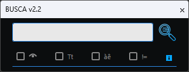

  `◖ clique esquerdo` → Abre a interface de busca.\
  opções em ordem:

  - buscar apenas em layers visíveis.
  - respeitar a caixa de texto (MAIÚSCULAS e minúsculas).
  - respeitar acentuação.
  - inverter busca, busca por layers de texto que **NÃO** contenham o termo buscado.

  <br>

  > 📋 *exemplo:*\
  > 

  > 🚩 *obs:*\
  > Por padrão a busca é feita ignorando acentuação e caixa do texto.\
  > Assim uma busca rápida por 'amazonia' pode retornar todos os layers de texto contendo 'amazonia', 'Amazônia', 'AmAzOnIa'...
