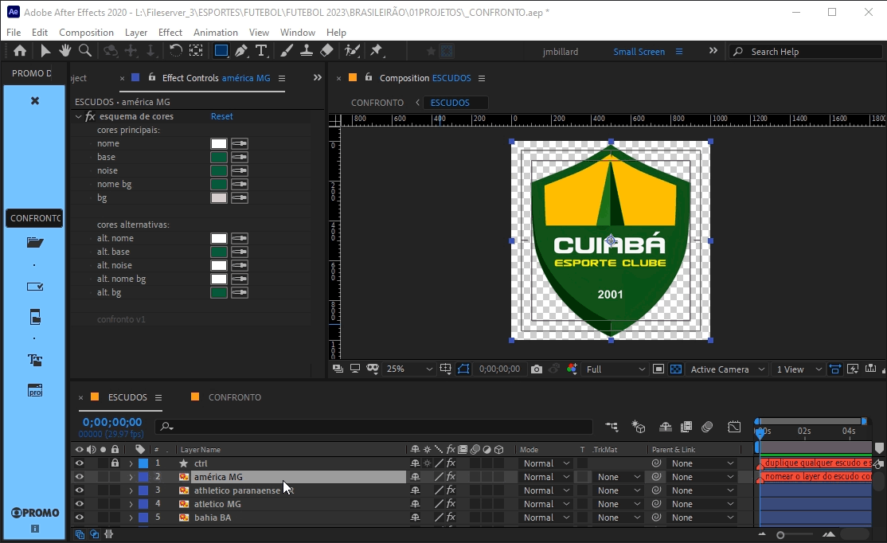
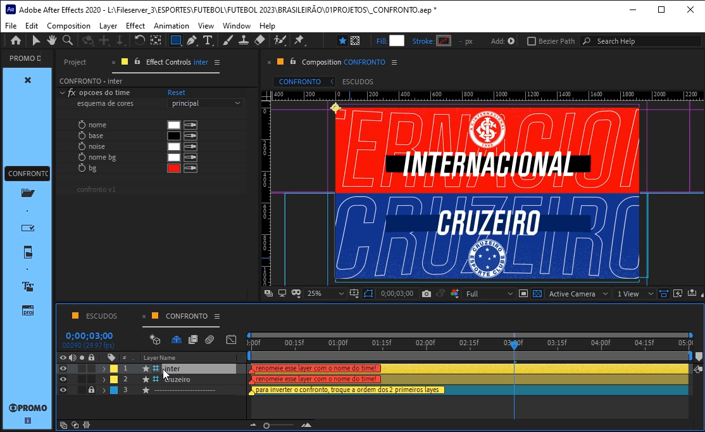
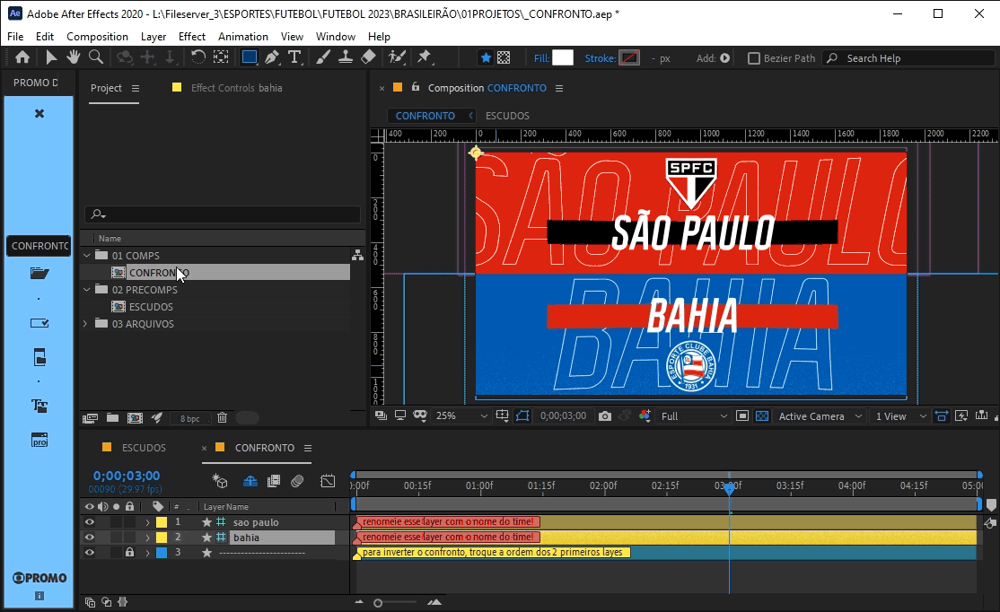

# 📓 CONFRONTO

> 📑 ***CONFRONTO.aet***

> 📂 **pastas:**\
> • **escudos** → `\\10.228.183.165\vfx\imagem\drive_l\Fileserver_3\ESPORTES\FUTEBOL\FUTEBOL 2023\ESCUDOS TIMES\ESCUDOS BRASIL`\
> • **output** → `\\10.228.183.174\edit_in_place\PROMO\cdesign_output\C# ABERTA & INTER\ARTE RJ\ESPORTES\FUTEBOL\BRASILEIRAO\2024\CONFRONTOS`
---

 

> 🎬 *preview:*\
> 

---

 

## 📍 funcionamento básico

1. abra a **comp** '*CONFRONTO*'.
2. renomeie os **layers 1** e **2** com o nome dos times.
3. use a *janela de controle de efeitos* para alterar as cores de cada time.
4. renomeie a **comp** '*CONFRONTO*' adicionando ' *-* ', mais os nomes dos respectivos times com um ' *X* ' entre eles.

> 📋 *exemplo:* "*CONFRONTO - FLAMENGO X CORINTHIANS*".

> 🚩 *obs:* Sempre use **CAIXA ALTA SEM ACENTUAÇÃO** e **SEM CARACTERES ESPECIAIS** para nomear **comps**.

---

 

## 📍 equipes disponíveis (2024)

- Palmeiras SP
- Atlético Mineiro MG
- Flamengo RJ
- Grêmio RS
- Botafogo RJ
- Red Bull Bragantino SP
- Fluminense RJ
- Athletico Paranaense PR
- Internacional RS
- Fortaleza CE
- São Paulo SP
- Cuiabá MT
- Corinthians SP
- Cruzeiro MG
- Vasco RJ
- Bahia BA
- Vitória ES
- Juventude RS
- Criciúma SC
- Atlético Goianiense GO

---

 

## 📍 parâmetros

os controles dos times estão nos 2 primeiros **layers** da **comp** '*CONFRONTO*', são eles:

### opções do time

- **esquema de cores**:

  - **principal** → cores principais do preset time.
  - **alternativo** → cores alternativas do preset time.
  - **livre** → todas as cores do time poderão ser alteradas.

- **nome** → controla a cor do nome.
- **base** → controla a cor da base atrás nome.
- **noise** → controla a cor do ruído do bg.
- **nome bg** → controla a cor do nome exibido no bg.
- **bg** → controla a cor do bg.

os controles dos presets de cor estão em cada **layer** da **comp** '*ESCUDOS*', são eles:

### esquema de cores

- **cores principais**:

  - **nome** → controla a cor do nome no esquema principal.
  - **base** → controla a cor da base atrás nome no esquema principal.
  - **noise** → controla a cor do ruído do bg no esquema principal.
  - **nome** bg → controla a cor do nome exibido no bg no esquema principal.
  - **bg** → controla a cor do bg no esquema principal.

- **cores alternativas**:
  - **alt. nome** → controla a cor do nome no esquema alternativo.
  - **alt. base** → controla a cor da base atrás nome no esquema alternativo.
  - **alt. noise** → controla a cor do ruído do bg no esquema alternativo.
  - **alt. nome bg** → controla a cor do nome exibido no bg no esquema alternativo.
  - **alt. bg** → controla a cor do bg no esquema alternativo.

---

 

## 🚨 Atenção!

para adicionar um novo escudo:

  1. abra a **comp** '*ESCUDOS*'.
  2. duplique um **layer** de escudo existente.
  3. substitua o **layer** duplicado pelo novo escudo.
  4. renomeie o **layer** duplicado com o nome do novo time seguido da sigla do estado.
  5. altere os presets de cor do novo time na *janela de controle de efeitos*.

> 📋 *exemplos de nome do **layer** de escudo:* "*cuiabá MT*", "*são paulo SP*".

> 🚩 *obs:* O nome do **layer** será sempre o nome do time exibido na **comp** '*CONFRONTO*'.

para alterar as cores de um escudo existente:

  1. abra a **comp** '*ESCUDOS*'.
  2. selecione o **layer** do escudo desejado.
  3. altere os presets de cor do time na *janela de controle de efeitos*.

> 📋 *exemplo:*\
> 

---

 

## ✨ dicas

não é preciso digitar o nome completo dos times na maioria das vezes, caso existam 2 times com o mesmo nome, basta digitar o nome completo incluindo a sigla do estado.

> 📋 *exemplo:* "*fla*" x "*flu*", "*fluminense de feira de santana*" x "*fluminense RJ*"

> 

> 🚩 *obs:* Maiúsculas e minúsculas assim como acentos e caracteres especiais são ignorados na busca dos nomes dos times, assim, "*fla*", "*FLA*" e "*fLÁ*" sempre mostrarão o nome do primeiro time que possuir "*FLA*" em seu nome.

---

para inverter a ordem dos times em um confronto basta alterar a ordem dos 2 primeiros **layers** da **com** '*CONFRONTOS*'.

> 📋 *exemplo:*\
> 

---

para agilizar a produção de múltiplos confrontos use a função de **renomear comps** na barra de **PROMO v0.3** ou superior.

> 📋 *exemplo:*\
> 
