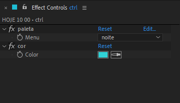

# 📓 VERTICAL LETTERING DIA HORA

> 📑 ****LETTERING_DIA_HORA.aet***

> 📂 **pastas:**\
> • **output** → `\\10.228.183.174\edit_in_place\PROMO\cdesign_output\C# ABERTA & INTER\ARTE RJ\INSTITUCIONAL\VERTICAIS\VERTICAL_ONAIR`

---

 

> 🎬 *preview:*\
> 

---

 

## 📍 funcionamento básico

1. abra a **comp** '*LETT - DIA HORA TEMPLATE*'.
2. edite o texto do **layer** '*txt_servico*' com o serviço/dia e/ou horário.
3. renomeie a **comp** '*LETT - DIA HORA TEMPLATE*' substituindo tudo pelo título - subtítulo e texto de apoio.

> 📋 *exemplos:* "*HOJE 12 00*", "*DAQUI A POUCO*".

> 🚩 *obs:* Sempre use **CAIXA ALTA SEM ACENTUAÇÃO** e **SEM CARACTERES ESPECIAIS** para nomear **comps**.

---

 

## 📍 parâmetros

todos os controles estão no **layer** '*ctrl*', são eles:

- **fx1**:

  - **opcao 1** → descrição.

---

 

## 🚨 Atenção!

aviso importante.

> 📋 *exemplo:*

> 🚩 *obs:*

---

 

## ✨ dicas

dica 1

> 📋 *exemplo:*\
> 

> 🚩 *obs:*

---

dica 2

> 📋 *exemplo:*\
> texto do exemplo.
