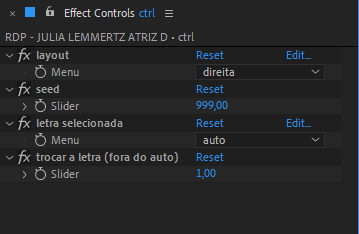

# 📓 CONVERSA COM BIAL RODAPÉ CONVIDADO

> 📑 ***RODAPE_CONVIDADO.aet***

> 📂 **pastas:**\
> • **output** → `\\10.193.48.13\promo_ber\BACKUP\artes\ARTES PARA EDICAO\CONVERSA COM BIAL\CONVIDADOS`

---

 

> 🎬 *preview:*\
> 

---

 

## 📍 funcionamento básico

1. abra a **comp** '*RDP - CONVIDADO TEMPLATE*'.
2. edite o texto do **layer** '*txt_nome*' com o nome e sobrenome do convidado.
3. se necessário, habilite e edite o texto do **layer** '*txt_info*' com um cargo ou profissão do convidado.
4. selecione o **layer** '*ctrl*'.
5. use a *janela de controle de efeitos* para acessar os controles disponíveis.
6. renomeie a **comp** '*RDP - CONVIDADO TEMPLATE*' substituindo as palavras '*CONVIDADO TEMPLATE*' pelo nome do convidado e a info, caso exista.

> 📋 *exemplo:* "*RDP - LIMA DUARTE ATOR*", "*RDP - BANDA EVA*".

> 🚩 *obs:* Sempre use **CAIXA ALTA SEM ACENTUAÇÃO** e **SEM CARACTERES ESPECIAIS** para nomear **comps**.

---

 

## 📍 parâmetros

todos os controles estão no **layer** '*ctrl*', são eles:

- **fx1**:

  - **opcao 1** → descrição.

---

 

## 🚨 Atenção!

aviso importante.

> 📋 *exemplo:*

> 🚩 *obs:*

---

 

## ✨ dicas

dica 1

> 📋 *exemplo:*\
> 

> 🚩 *obs:*

---

dica 2

> 📋 *exemplo:*\
> texto do exemplo.
