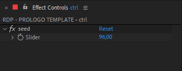

# 📓 OS OUTROS RODAPÉ PRÓLOGO

> 📑 ***RODAPE_PROLOGO.aet***

> 📂 **pastas:**\
> • **output** → `\\10.228.183.174\edit_in_place\PROMO\cdesign_output\C# ABERTA & INTER\ARTE RJ\SERIES E SERIADOS\SERIES NACIONAIS\OS OUTROS\PROLOGO`

---

 

> 🎬 *preview:*\
> 

---

 

## 📍 funcionamento básico

1. abra a **comp** '*RDP - PROLOGO TEMPLATE*'.
2. edite o texto do **layer** '*txt_info*' com texto do prólogo.
3. renomeie a **comp** '*RDP - PROLOGO TEMPLATE*' substituindo as palavras '*PROLOGO TEMPLATE*' pelo texto do prólogo.

> 📋 *exemplo:* "*RDP - NO ULTIMO EPISODIO*", "*RDP - ULTIMAS SEMANAS*".

> 🚩 *obs:* Sempre use **CAIXA ALTA SEM ACENTUAÇÃO** e **SEM CARACTERES ESPECIAIS** para nomear **comps**.

---

 

## 📍 parâmetros

todos os controles estão no **layer** '*ctrl*', são eles:

- **layout**:

  - **esquerda** → posiciona o texto no lado esquerdo.
  - **direita** → posiciona o texto no lado esquerdo.

---

 

## 🚨 Atenção!

aviso importante.

> 📋 *exemplo:*

> 🚩 *obs:*

---

 

## ✨ dicas

dica 1

> 📋 *exemplo:*\
> 

> 🚩 *obs:*

---

dica 2

> 📋 *exemplo:*\
> texto do exemplo.
